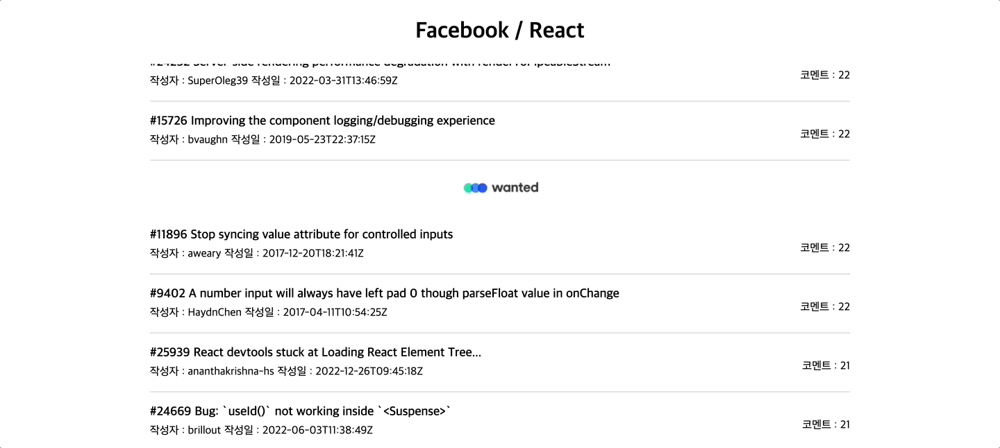

# Github-Issues-Reader

## 프로젝트 소개

- 주제 : 특정 깃헙 레파지토리([Issues React]('https://github.com/facebook/react/issues'))의 이슈 목록과 상세 내용을 확인하는 웹 사이트 구축
- 작업 기간 : 2023.08.29 - 2023.09.01
- 팀 레포지토리 : [바로가기]('https://github.com/pre-onboarding-12th-team3/pre-onboarding-12th-2-3')

## 배포 URL

[배포 URL 바로가기](https://pre-onboarding-12th-2-ukss.vercel.app/)

## 기술 스택

     

## 설치 및 실행

1. 저장소 복제 (Clone Repository)

```zsh
$ git clone https://github.com/ukssss/github-issues-reader.git
```

2. 환경 변수 설정 (Set Environment Variable)

```zsh
$ REACT_APP_ACCESS_TOKEN = YOUR_GITHUB_AUTH_TOKEN
```

3. 종속성 설치 (Install Dependencies)

```zsh
$ npm install
```

4. 애플리케이션 실행 (Run Application)

```zsh
$ npm start
```

## 폴더 구조

```base
src
 ┣ assets
 ┃ ┗ spinner.svg
 ┣ components
 ┃ ┣ Advertisement
 ┃ ┃ ┗ Advertisement.tsx
 ┃ ┣ Button
 ┃ ┃ ┗ Button.tsx
 ┃ ┣ Header
 ┃ ┃ ┗ Header.tsx
 ┃ ┣ IssueDetail
 ┃ ┃ ┗ IssueDetail.tsx
 ┃ ┣ IssueList
 ┃ ┃ ┗ IssueList.tsx
 ┃ ┣ IssueListItem
 ┃ ┃ ┗ IssueListItem.tsx
 ┃ ┣ Loading
 ┃ ┃ ┗ Loading.tsx
 ┃ ┣ ScrollObserver
 ┃ ┃ ┗ ScrollObserver.tsx
 ┃ ┗ index.ts
 ┣ constants
 ┃ ┣ apiConstants.ts
 ┃ ┗ index.ts
 ┣ contexts
 ┃ ┣ IssueContext.tsx
 ┃ ┗ index.ts
 ┣ customTypes
 ┃ ┣ index.ts
 ┃ ┣ issueDetail.d.ts
 ┃ ┣ issueList.d.ts
 ┃ ┗ svg.d.ts
 ┣ hooks
 ┃ ┗ useInfiniteScroll.tsx
 ┣ pages
 ┃ ┣ DetailPage.tsx
 ┃ ┣ ErrorPage.tsx
 ┃ ┣ MainPage.tsx
 ┃ ┗ index.ts
 ┣ routes
 ┃ ┗ router.tsx
 ┣ utils
 ┃ ┣ calculateIndex.ts
 ┃ ┣ fetchData.ts
 ┃ ┗ index.ts
 ┣ App.css
 ┣ App.tsx
 ┣ index.css
 ┗ index.tsx
```

## 구현 내용

| Issue List                           |
| ------------------------------------ |
|  |

| Issue Detail                             |
| ---------------------------------------- |
|  |

#### 1. octokit 을 통한 Github Repository Request

작업중

#### 2. intersectionObserver 사용을 통한 인피니티 스크롤(Infinity Scroll) 구현

작업중

## 커밋 컨벤션

```

- Feat | 새로운 기능을 추가
- Fix | 버그 수정
- Design | CSS 등 사용자 UI 디자인 변경
- !BREAKING CHANGE | 커다란 API 변경의 경우
- !HOTFIX | 급하게 치명적인 버그를 고쳐야 하는 경우
- Style | 코드 포맷 변경, 세미 콜론 누락, 코드 수정이 없는 경우
- Refactor | 프로덕션 코드 리팩토링
- Comment | 필요한 주석 추가 및 변경
- Docs | 문서 수정
- Test | 테스트 코드, 리팩토링 테스트 코드 추가, Production Code(실제로 사용하는 코드) 변경 없음
- Chore | 빌드 업무 수정, 패키지 매니저 수정, 패키지 관리자 구성 등 업데이트, Production Code 변경 없음
- Rename | 파일 혹은 폴더명을 수정하거나 옮기는 작업만인 경우
- Remove | 파일을 삭제하는 작업만 수행한 경우

```
